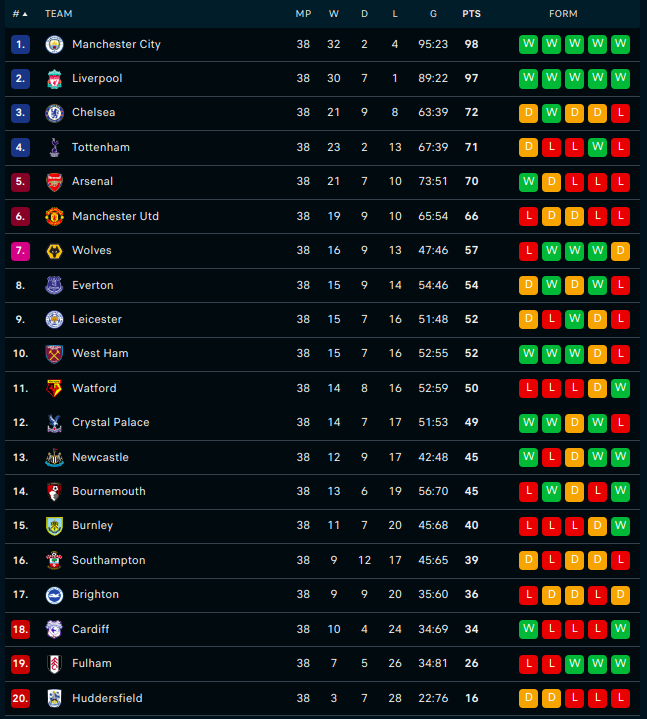
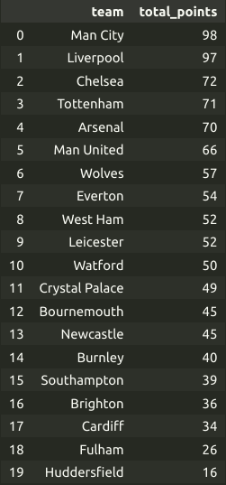

# :rocket: Mini Project Data Analysis

## Binder Launcher

<div align="">
  <a href="https://mybinder.org/v2/gh/ayubhr/mini-projet-data-analysis/main?filepath=index.ipynb">
    
  </a>
</div>

## Overview 


* #### Theme : 
  * ##### Soccer Data :soccer:

  *  >  data of every game from the 2018-2019 season in the English Premier League. 


* #### the objective case : 

  * > analye and explore soccer data to get the most of statistical analyses

    1. Explore
    2. Analyse
    3. Visualize   

## Dataset

  - > First 5 items of csv data

  - |Div|Date|HomeTeam|AwayTeam|FTHG|FTAG|FTR|HTHG|HTAG|HTR|Referee|HS|AS|HST|AST|HF|AF|HC|AC|HY|AY|HR|AR|
    |---|---|---|---|---|---|---|---|---|---|---|---|---|---|---|---|---|---|---|---|---|---|---|
    |E0|10/8/18|Man United|Leicester|2|1|H|1|0|H|A Marriner|8|13|6|4|11|8|2|5|2|1|0|0|
    |E0|11/8/18|Bournemouth|Cardiff|2|0|H|1|0|H|K Friend|12|10|4|1|11|9|7|4|1|1|0|0|
    |E0|11/8/18|Fulham|Crystal Palace|0|2|A|0|1|A|M Dean|15|10|6|9|9|11|5|5|1|2|0|0|
    |E0|11/8/18|Huddersfield|Chelsea|0|3|A|0|2|A|C Kavanagh|6|13|1|4|9|8|2|5|2|1|0|0|
    |E0|11/8/18|Newcastle|Tottenham|1|2|A|1|2|A|M Atkinson|15|15|2|5|11|12|3|5|2|2|0|0|


#### Data Dictionary
-   | Column    | Explanation                                   |
    | --------- | --------------------------------------------- |
    | Div       | Division the game was played in               |                            
    | Date      | The date the game was played                  |
    | HomeTeam  | The home team                                 |
    | AwayTeam  | The away team                                 |
    | FTHG      | Full time home goals                          |
    | FTAG      | Full time away goals                          |
    | FTR       | Full time result                              |
    | HTHG      | Half time home goals                          |
    | HTAG      | Half time away goals                          |
    | HTR       | Half time result                              |
    | Referee   | The referee of the game                       |
    | HS        | Number of shots taken by home team            |
    | AS        | Number of shots taken by away team            |
    | HST       | Number of shots taken by home team on target  |
    | AST       | Number of shots taken by away team on target  |
    | HF        | Number of fouls made by home team             |
    | AF        | Number of fouls made by away team             |
    | HC        | Number of corners taken by home team          |
    | AC        | Number of corners taken by away team          |
    | HY        | Number of yellow cards received by home team  |
    | AY        | Number of yellow cards received by away team  |
    | HR        | Number of red cards received by home team     |
    | AR        | Number of red cards received by away team     |


## Files :

   * ###### Soccer data  :  [soccer_data.csv](data/soccer_data.csv)
   * ###### Soccer data variables  :  [soccer_data_vars.csv](data/soccer_data_vars.csv)


## Conclusion :  

  > As you can see we get to final standing from all premier league matches for saison 2018-2019

  Flashscore standing             |  Parsed standing
:-------------------------:|:-------------------------:
  |  


## Notes 

The `requirements.txt` file should list all Python libraries that your notebooks
depend on, and they will be installed using:

```
pip install -r requirements.txt
```

